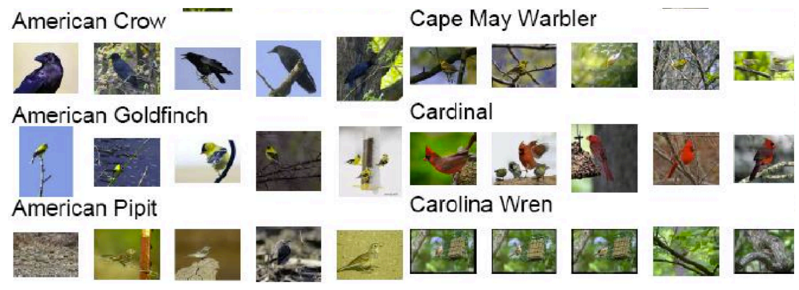

# 🦜 Bird Species Exploration and Retrieval

This project explores the use of **Foundation Models** for **bird species recognition, textual description generation, and image retrieval**. It employs **CLIP, BLIP-2, and Llava** to classify bird species, generate detailed descriptions, and retrieve relevant images from textual inputs. The **CUB-200-2011 dataset** is used as the primary dataset for training and evaluation.

## 

## 🚀 Project Tasks

### **Task 1: Bird Species Recognition with CLIP**

📌 **Objective:** Employ CLIP for image classification to identify bird species within the **CUB-200-2011 dataset**.

🔹 Introduce CLIP and its dual capability for understanding both images and text.
🔹 Use CLIP to recognize bird species in images, leveraging its pre-trained knowledge for accurate classification.

---

### **Task 2: Textual Description Enhancement with an Image Captioner**

📌 **Objective:** Use **BLIP-2** or **Llava** to generate detailed and nuanced textual descriptions of the bird images.

🔹 Explain the model’s capabilities in generating rich textual content from images.
🔹 Input bird images to the image captioner to create **enhanced textual descriptions**, capturing specific attributes, behaviors, and environments of the birds.

---

### **Task 3: Image and Cross-Modal Retrieval with CLIP**

📌 **Objective:** Develop an image and **cross-modal retrieval system** using CLIP to find dataset images based on textual descriptions or visual similarity.

🔹 Introduce **image retrieval** and **cross-modal retrieval**, highlighting CLIP's effectiveness in these tasks.
🔹 Implement a **retrieval system** with CLIP that returns relevant bird images from the dataset when given a textual description or an input image.
🔹 Test the system with a variety of **descriptions and images** to evaluate its accuracy in retrieving correct matches.

---

## 📂 Dataset

- **CUB-200-2011** ([Perona Lab - CUB-200-2011](https://www.vision.caltech.edu/datasets/cub_200_2011/))
- Contains **200 bird species** with **11,788 images**.
- Includes **detailed annotations** for each bird (species, attributes, bounding boxes, etc.).
- We added a json file called "llava_captions.json" that includes the path of images, class_label, visible parts and the extracted llava_caption based on the image and the visible parts (image description).

---

## 🔧 Installation & Setup

### **1️⃣ Clone the Repository**

```bash
 git clone https://github.com/miretteamin/Bird-Species-Exploration-and-Retrieval.git
 cd Bird-Species-Exploration-and-Retrieval
```

<!-- ### **2️⃣ Install Dependencies**
```bash
 pip install torch torchvision transformers diffusers datasets
``` -->

### **3️⃣ Download Dataset**

```bash
 wget http://www.vision.caltech.edu/visipedia-data/CUB-200-2011/CUB_200_2011.tgz
 tar -xvzf CUB_200_2011.tgz
```

---

## 🛠️ Models & Libraries Used

- **CLIP** (for Image Classification & Retrieval)
- **BLIP-2 / Llava** (for Image Captioning)
- **Hugging Face Transformers & Diffusers** (for model implementation)

---

<!--
## 📚 Tutorials & Resources

🔹 Running **BLIP-2** on Colab → [Chat with BLIP-2](https://huggingface.co/spaces/Salesforce/BLIP-2)
🔹 Running **Llava** on Colab → [LLaVa](https://github.com/haotian-liu/LLaVA)
🔹 Tutorial on Image Retrieval → [Image Similarity with Hugging Face](https://huggingface.co/blog/image-similarity)
🔹 Research Paper: **Zero-Shot Composed Image Retrieval with Textual Inversion** ([2303.15247](https://arxiv.org/abs/2303.15247)) -->

---

<!-- ## 📌 Future Work
- Implement **text-to-image generation** using **Stable Diffusion** to reconstruct birds from descriptions.
- Fine-tune **CLIP on CUB-200-2011** for improved retrieval accuracy.
- Explore **GAN-based image enhancement** to refine generated images.

---

## 🤝 Contributing
Contributions are welcome! Feel free to submit **issues**, **pull requests**, or suggest improvements. -->

---

<!-- ## 📜 License
This project is licensed under the **MIT License**. -->
